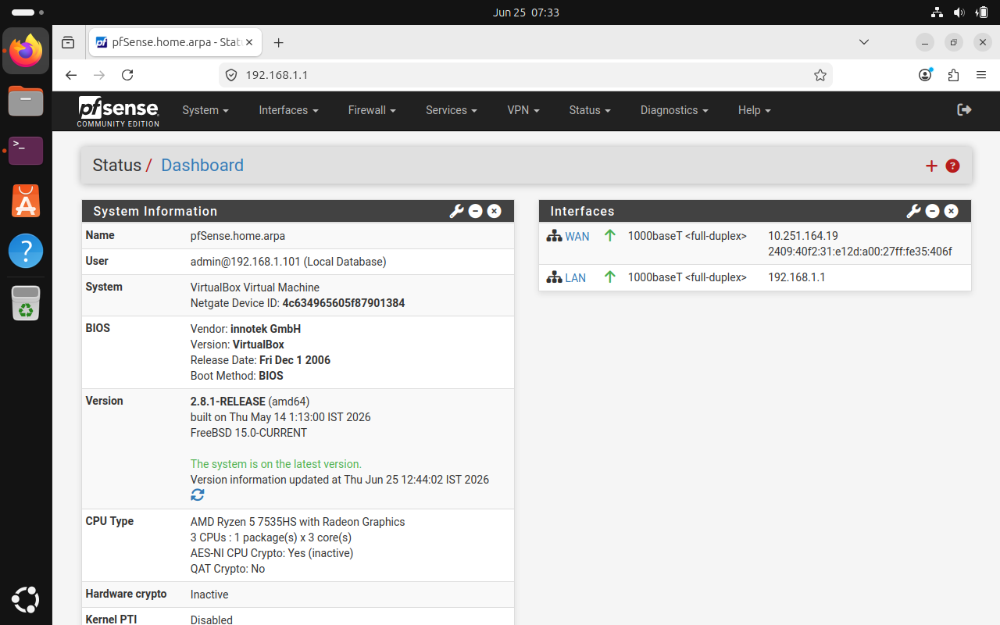
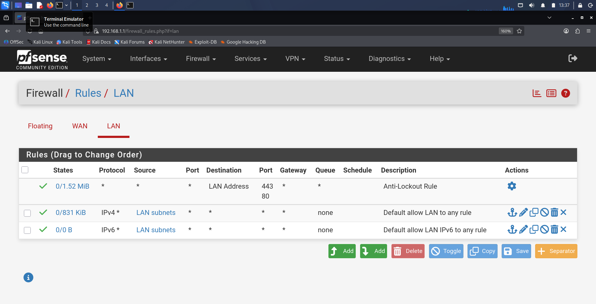
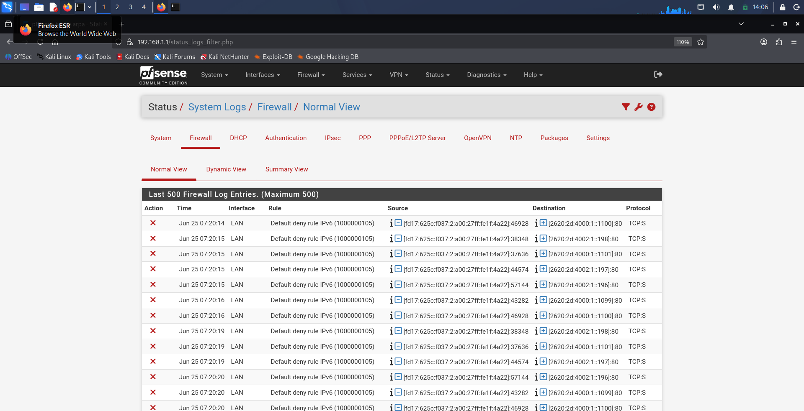
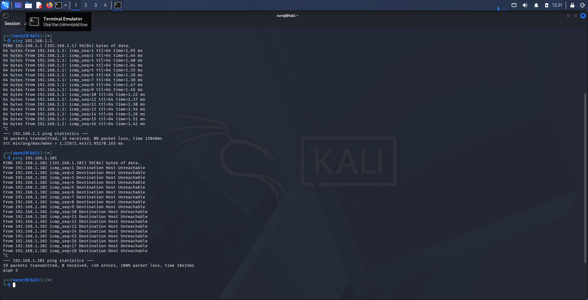
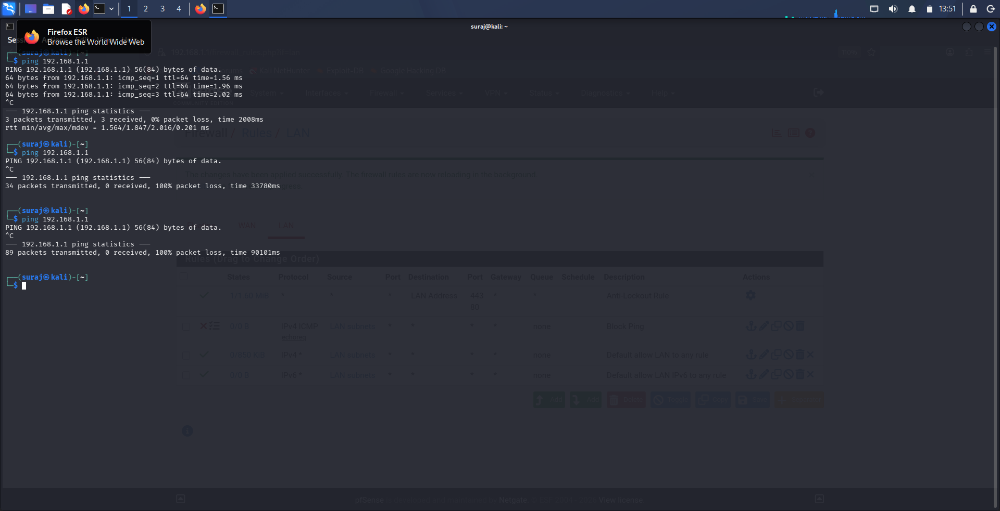
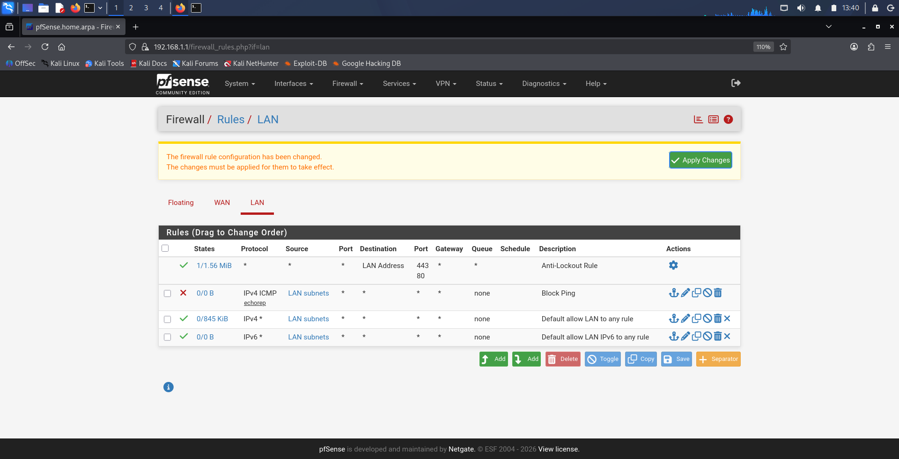
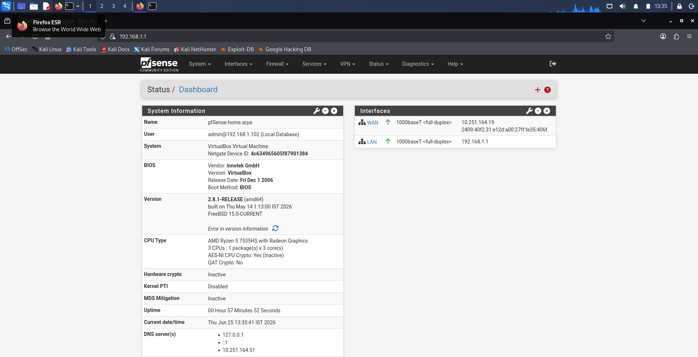
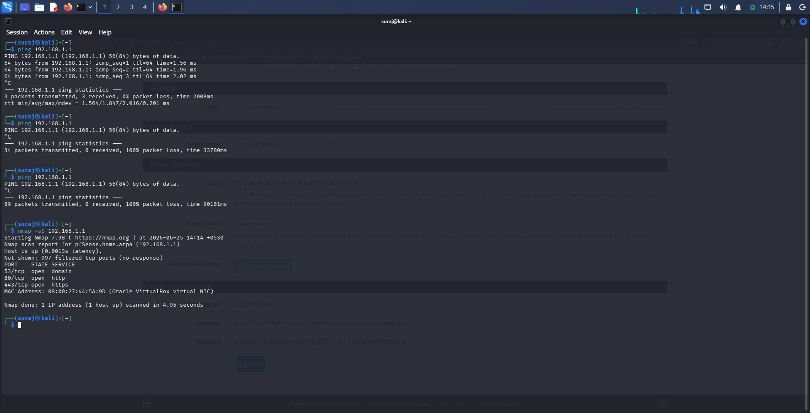
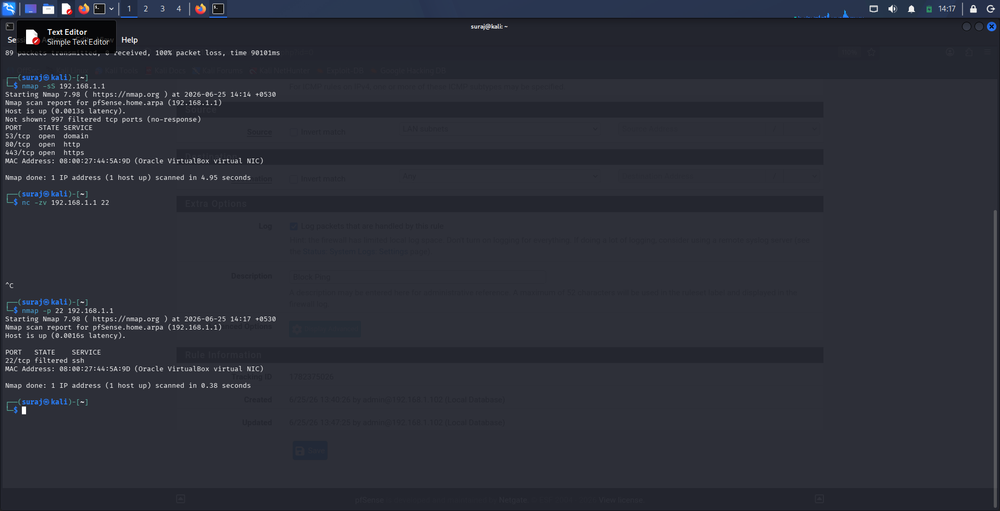

# 🛡️ pfSense Network Firewall Lab

## 📖 Project Overview

This project demonstrates how to configure and manage a pfSense firewall in a VirtualBox lab environment. The lab consists of pfSense, Kali Linux, and Ubuntu virtual machines. Firewall rules were created to block ICMP (ping) traffic while allowing normal network communication. The configuration was verified using Ping and Nmap.

## 🎯 Objectives

- Configure pfSense as a virtual firewall.
- Create and manage firewall rules.
- Block ICMP (Ping) traffic.
- Verify firewall functionality using Ping and Nmap.

## 🖥️ Lab Environment

- pfSense CE 2.8.1
- Kali Linux (Attacker/Test Machine)
- Ubuntu (Client Machine)
- Oracle VirtualBox

## 🗺️ Network Topology

Kali Linux (192.168.1.102)
        │
        │ LAN
        ▼
+--------------------+
|     pfSense        |
| LAN: 192.168.1.1   |
| WAN: NAT Adapter   |
+--------------------+
        │
        ▼
      Internet
      
## ⚙️ Technologies Used

- pfSense CE 2.8.1
- Oracle VirtualBox
- Kali Linux
- Ubuntu Linux
- Nmap
- ICMP (Ping)
  
## 🔧 Configuration Steps

- Installed pfSense Community Edition.
- Configured WAN and LAN interfaces.
- Assigned LAN IP address (192.168.1.1).
- Created an ICMP blocking firewall rule.
- Applied firewall configuration changes.
- Verified the rule using Ping and Nmap.

## 🔒 Firewall Rules Implemented

- Block ICMP Echo Request traffic.
- Allow LAN clients to access permitted services.
- Retain Anti-Lockout Rule for pfSense management.

## 🧪 Testing

- Verified normal connectivity using Ping.
- Confirmed ICMP blocking after applying firewall rules.
- Verified filtered ports using Nmap.

## 📊 Results

- Successfully blocked ICMP Echo Requests.
- Verified firewall rule using Ping.
- Confirmed SSH port filtering using Nmap.
- Firewall logs captured blocked packets.

## 📸 Screenshots

### 1. pfSense Dashboard

### 2. LAN Firewall Rules

### 3. ICMP Block Rule Created

### 4. Ping Blocked Test

### 5. Firewall Logs Showing Blocked Packets

### 6. Ping Before Firewall Rule

### 7. Destination Host Unreachable

### 8. Nmap Scan Before SSH Block

### 9. Nmap SSH Port Filtered

## 💻 Skills Demonstrated

- Firewall Configuration
- Network Security
- Packet Filtering
- Network Troubleshooting
- Nmap Network Scanning
- Virtualization using Oracle VirtualBox

## 🚀 Future Improvements

- Configure Snort IDS/IPS.
- Implement VPN remote access.
- Create VLAN-based network segmentation.
- Configure Intrusion Prevention System (IPS).
- Implement advanced firewall policies.
